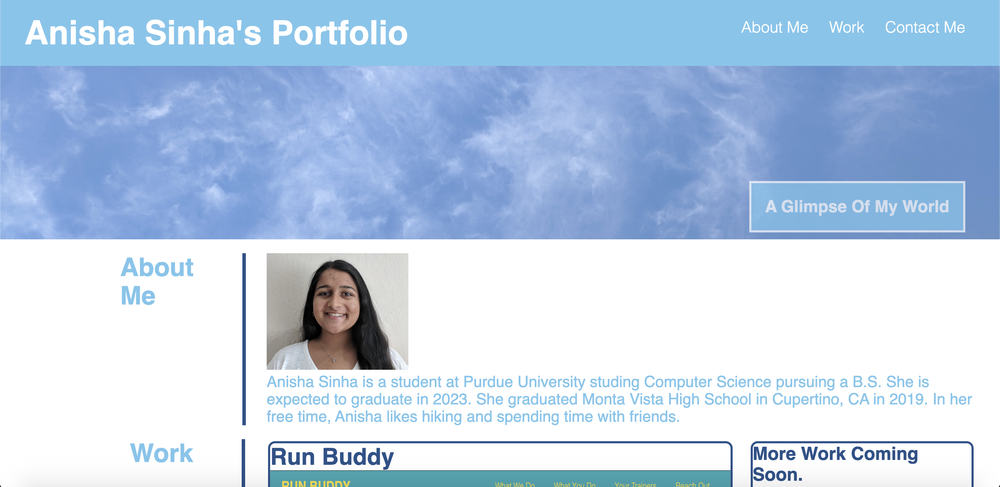
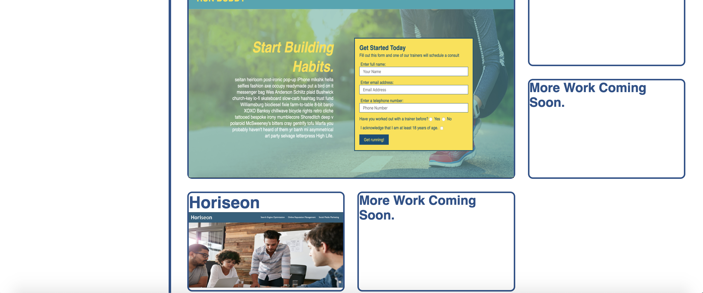

# Project Description
The goal of this project is to create a professional portfolio from scratch that includes an about me section, work section, and contacts section. The site uses flexbox, grids, and media queries. It is also resizable. This website would be used for hiring managers to see a candidate's skills and learn a little bit about them. 

# What the Website Looks Like
This is three separate images but the actual website is seamless. Visit the link to the deployed application to see what it actually looks like. 

# Link to Deployed Application
Link: https://anishasnet.github.io/